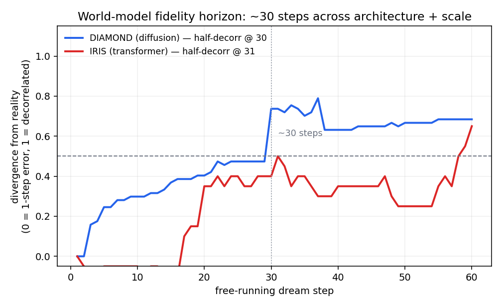
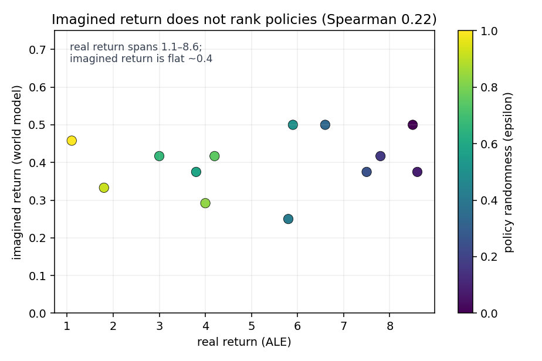

# world-model-eval

Experiments on an open generative **world model** (DIAMOND — a diffusion world
model that generates a playable Atari environment frame by frame), run headless
on Modal. Sibling to [`inside-the-agent`](../inside-the-agent).

## What this is, in plain terms

A **world model** is a neural network that learns to *imagine* an environment:
give it the last few frames of a game plus an action and it generates the next
frame, so an agent can "play" entirely inside the model's dream. The promise for
AI is that if the dream is accurate, you could train and test agents inside it
instead of in the slow, expensive real world.

This repo asks a simple question of a small open world model (DIAMOND, playing
Atari Breakout): how long does the dream stay true to reality? It predicts the
*next* frame almost perfectly, but once it runs on its own the dream drifts off
within ~10 to 30 steps, and faster when the agent takes unusual actions. That
single gap (great for one step, unreliable over many) decides what the model is
good for. Reading the current game state works (ball position R²≈0.78).
Simulating far enough ahead to rank policies or plan does not.

**Why it matters.** Most "imagination-based" AI assumes you can roll a world
model forward for many steps: to dream training episodes, to plan, or to cheaply
evaluate policies. These bug-checked measurements show that for a small open
model the trustworthy horizon is short, and shortest exactly when the agent acts
off its usual policy, which is when a planner would lean on it most. This does
not refute methods like DreamerV3 (which keep imagination short and in a compact
latent space for this very reason); it pins the limit down concretely and
separates two things that get lumped together: predicting one step (works)
versus simulating many (bounded).

## The fidelity horizon: near-perfect 1-step, short and policy-dependent

Free-running DIAMOND's dream from a real trajectory's context under the same
actions as the real env: the **one-step prediction error is 0.0020** (≈ the
natural consecutive-frame change of 0.0022 — near-perfect), but free-running
**half-decorrelates within tens of steps, and how fast depends on the policy**:
~30 steps under the agent's own greedy policy (68% bootstrap CI [30, 34]) vs
**~10 under random actions** ([7, 14]), non-overlapping over 24 trajectories. So
the horizon is real but it's an *in-distribution* number, not a constant.

The model decodes instantaneous state cleanly but neither sustains nor controls it:

- **Decode works** (ball-position R²≈0.78 [0.72, 0.82], ground-truth real-frame
  labels + leakage-free time-split): one faithful frame is enough; 1-step
  fidelity is excellent.
- **Multi-step policy evaluation fails**: it needs *sustained* fidelity, but the
  dream decorrelates within ~30 steps (DreamEval's imagined reward saturates by
  ~20–30 — the same horizon).
- **Steering fails too** (decode ≫ steer): the decoded ball direction moves the
  ball no more than a matched-norm random direction — bug-checked, it holds even
  injected post-normalization. See [`docs/steering_study.md`](docs/steering_study.md).

Code: `app_eval.py::fidelity`.

### Does the horizon generalize across architecture and scale? No.

Running the same measurement on **IRIS** (a VQ-VAE + Transformer world model,
several times larger than DIAMOND's 4.4M diffusion core) under a **matched
random-action protocol**: DIAMOND half-decorrelates by step **10** [7, 14], but
IRIS only reaches a *sustained* half-decorrelation at step **58** [21, 60] (10%
of bootstrap resamples never cross within 60 steps). Not identical.

Two things make a "universal ~30-step constant" untenable: the horizon is
policy-dependent (above), and **L1 frame divergence isn't comparable across the
two frame types** — IRIS's discrete VQ-VAE frames stay crisp and low-L1 even
when semantically wrong, while DIAMOND's continuous diffusion frames blur and
drift. Honest read: each model has its own policy-dependent fidelity horizon;
there is no shared ~30-step number. Code: `app_iris.py::fidelity`. (Both are
small/medium Atari models.)

*Each curve normalized to its own floor-to-ceiling (0 = 1-step error, 1 = that
run's decorrelated reference). Under a matched random-action protocol DIAMOND
(dashed) crosses half-decorrelation at ~10 and IRIS (red) only at the noisy edge
of the 60-step window; DIAMOND's "~30" (solid) holds only under its own greedy
policy. The earlier "DIAMOND ~30 ≈ IRIS ~31" compared mismatched policies with a
noise-sensitive first-touch crossing.*

---

The same DIAMOND-on-Modal infrastructure powers the applied study below,
explained by the fidelity horizon above:

### DreamEval — world model as a cheap policy evaluator

**Can the world model's *imagined* return rank policies the way the real env
does?** Score a spectrum of policies by imagined return (rolled out inside the
world model, scored by its reward model) and measure the correlation with real
return in the actual Atari env. The canonical applied use-case for world models
(policy evaluation without expensive real trials), validated on Atari.

**Result (DIAMOND-Breakout): imagined return is *not* a reliable policy
evaluator here.** Across an epsilon-greedy spectrum (eps 0 = good → 1 = random),
real return falls cleanly (8.9 → 1.7) but imagined return stays **flat at ~0.4
regardless of policy quality** (random ≈ good). The rank correlation is sample-
fragile: at 7 coarse policies it looks promising (Spearman 0.78, p=0.04) but
that is driven by the good-vs-random extremes + small n — on a **finer 13-policy
grid it collapses to near zero (Spearman 0.22, then 0.01 on a bug-checked
re-run; both p≫0.1)**. The dream's imagined reward
**saturates by ~20–30 steps** (the rollout goes inert after the ball is lost),
so it captures only the coarsest good-vs-random distinction, not a usable
ranking.

*Real return falls cleanly from 8.9 to 1.7 across the epsilon spectrum (color),
but imagined return stays flat at ~0.4 regardless of policy quality. Spearman
0.01 (p=0.96) at 13 policies: no usable ranking signal.*

Takeaway: a small open world model decodes state well (ball-position R²≈0.78)
but its imagined rollouts are too low-fidelity to rank policies at fine
resolution. It **decodes but does not faithfully *simulate***.

Code: `modal_deploy/app_eval.py` · plan: [`BUILD_PLAN.md`](BUILD_PLAN.md)

---

## Limitations

A careful but small-scale study; the bug-checked numbers carry real caveats.

- **Window-relative horizons.** The half-decorrelation step is normalized to
  each run's floor-to-ceiling (ceiling = L1 between real frames `horizon` apart).
  Greedy first-touch is stable (~30 at windows of 30/60/120), but the *sustained*
  crossing drifts (30→68) and the *random*-policy crossing slides 5→10→22 with
  the window (its curve never plateaus), so the off-policy "horizon" is only
  loosely defined.
- **L1 isn't comparable across frame types.** IRIS's discrete VQ-VAE frames stay
  crisp/low-L1 even when wrong; DIAMOND's diffusion frames blur. The
  cross-architecture comparison is directional, not a calibrated metric.
- **CV-detector measurement.** Ball position comes from a frame-differencing
  detector. The ground-truth probe (`probe_truth`, real-frame labels) sidesteps
  it for decode, but the steering outcome still uses it and conflates frame
  degradation with motion under large perturbations. Paddle decode is degenerate
  (constant label) and is dropped.
- **Decode is rollout-sensitive.** On generated frames ball_x R² ranged 0.73–0.91
  across rollouts; the headline 0.78 [0.72, 0.82] is the ground-truth, leakage-
  free time split (n≈357).
- **Small samples, single game.** Breakout only; 16–24 fidelity trajectories, 13
  policies for DreamEval; both world models are small/medium Atari-100k models.
- **DreamEval mechanism.** The flat imagined return is attributed to fidelity
  decay (imagined reward saturates by ~50 steps); we have not separated
  reward-model error from dynamics error (a teacher-forced reward check would).

---

Infra: DIAMOND on Modal L40S — hydra load + `eval` resolver,
`make_atari_env`, seeded `WorldModelEnv` (collect real ALE frames → imagine
under the agent's policy). Tiny 4.4M-param denoiser; cheap to run.

Status: DreamEval E1–E3 done. Strengthening (more rollouts, then a 13-policy
grid) reversed the n=7 positive: imagined return does not reliably rank policies
(Spearman near zero, p≫0.1 at 13 policies). Honest negative; decode ≫ simulate.

Headline numbers are bug-checked: decode R² uses ground-truth real-frame labels
+ a leakage-free time split with a bootstrap CI; the fidelity crossing uses a
sustained metric + bootstrap CI and is reported across action policies and
window lengths; and the cross-architecture comparison uses a matched action
protocol — which removed an earlier, confounded "~30 ≈ ~31" claim. See Limitations.
