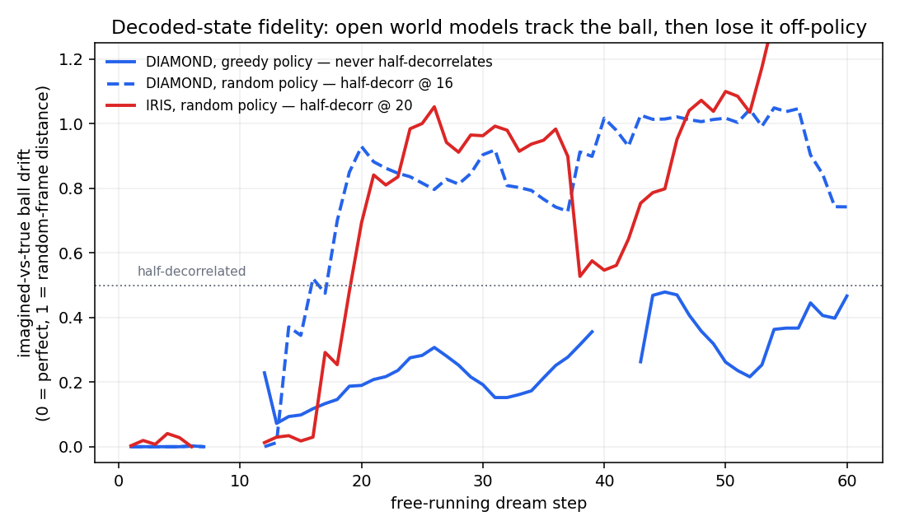

# world-model-eval

An evaluation of what open, **small world models** can and can't do. A world
model is a network that imagines an environment frame by frame: give it the last
few frames plus an action and it generates the next frame, so an agent can "play"
inside its dream. Here: DIAMOND (diffusion) and IRIS (transformer) on Atari
Breakout, run headless on Modal. Sibling to [`inside-the-agent`](../inside-the-agent).

## TL;DR — strong state estimators, weak simulators

- **Decode works.** The true ball position is linearly readable from the world
  model's activations at **R²≈0.78** (ground-truth labels, leakage-free split),
  and 1-step prediction is near-perfect (frame error 0.0020 ≈ the 0.0022 natural
  frame-to-frame change).
- **Simulation has a cliff.** Free-running, the dream keeps the ball within ~6px
  of truth for **60 on-policy steps**, but off-policy it loses the ball by
  **~16–20 steps**. DIAMOND (16) and IRIS (20) land close in comparable units, so
  the off-policy cliff is roughly architecture-independent at this scale.
- **So use them accordingly.** A small world model is a good tool for **state
  estimation and short-horizon, on-policy rollout**, and a poor one for **ranking
  policies from raw imagined return, or planning far ahead by free-running
  pixels**. The ball-drift metric here locates that cliff for any new model.
  (Production methods like DreamerV3 engineer around this cliff with a compact
  latent space, short horizons, and a value function; see *Relation to prior
  world-model work* below.)
- **Two downstream failures, one root cause.** Imagined return does **not** rank
  policies (Spearman ≈ 0), and the decoded state direction does **not** steer the
  ball (decode ≫ steer). Both sit past the fidelity cliff.

*Imagined-vs-true ball drift, normalized to each run's random-frame ceiling.
On-policy (solid blue) the dream tracks the ball for 60 steps; off-policy DIAMOND
(dashed blue) and IRIS (red) both half-decorrelate at ~16–20 steps. Measured in
ball pixels, which is comparable across architectures unlike raw pixel L1.*

## In plain terms

The promise of world models is that if a model can dream an environment
accurately, you can train and test agents inside the dream instead of the slow,
expensive real world. The catch is *how long the dream stays true*. This repo
measures exactly that, and finds the dream is excellent for one step and for
reading the current state, but drifts off within tens of steps once it runs on
its own (and faster when the agent does something unusual). That gap is the whole
story: it decides what the model is good for.

## Fidelity: predict vs simulate

The headline uses **ball drift** (how far the imagined ball is from the true
ball), because it weights the signal that matters and is comparable across
DIAMOND's continuous frames and IRIS's discrete VQ-VAE frames.

A coarser whole-frame **L1** view (`artifacts/fidelity_horizon.png`) is
consistent but easy to misread: L1 is dominated by the static Breakout
background, so it *overstates* decoherence (it counts bricks, paddle and
rendering, not just the ball) and is not comparable across the two frame types.
In L1, DIAMOND's free-run half-decorrelates at ~30 on-policy steps and ~10
off-policy (sustained crossing + bootstrap CIs). An earlier version of this repo
read those L1 numbers as a *universal* ~30-step horizon "across architecture and
scale"; that was a confound (mismatched action policies, a noise-sensitive
crossing, and L1's frame-type incomparability). The ball-drift metric above is
the corrected, fair comparison, and it says something narrower and sturdier: the
on-policy dream tracks state well for tens of steps, and the off-policy cliff is
similar (~16–20 steps) across the two architectures.

Code: `app_eval.py::fidelity` (L1) and `::fidelity_ball` (ball drift);
`app_iris.py` for the IRIS port.

## DreamEval — world model as a cheap policy evaluator

**Can the world model's *imagined* return rank policies the way the real env
does?** Score a spectrum of epsilon-greedy policies by imagined return (rolled
out inside the world model, scored by its reward model) and correlate with real
return in the actual Atari env. This is the canonical applied use-case: policy
evaluation without expensive real trials.

**Result (DIAMOND-Breakout): no.** Real return falls cleanly across the spectrum
(8.9 → 1.7) but imagined return stays **flat at ~0.4 regardless of policy
quality** (random ≈ good). The rank correlation is sample-fragile: 7 coarse
policies look promising (Spearman 0.78, p=0.04), driven by the good-vs-random
extremes and small n, but a **13-policy grid collapses to ≈ 0 (Spearman 0.22,
then 0.01 on a bug-checked re-run; both p≫0.1)**. Mechanism: the dream loses the
ball by ~16–20 steps (above) and imagined reward saturates by ~step 50, so a good
policy's real edge — sustained play over hundreds of steps — accrues *past* the
fidelity cliff, where the dream can't see it.

**Scope of this claim — tested.** Raw imagined return is the naive evaluator;
DreamerV3 instead credits reward beyond a short horizon with a value function.
`run_eval_value` tests exactly that, scoring four signals against real return
using DIAMOND's own critic: raw return, discounted return, a value-bootstrapped
return (discounted reward + γ^H·V(s_H)), and the mean critic value over visited
states. **The value fix does not rescue ranking here** — all four stay flat
(Spearman −0.10 raw, −0.10 value-bootstrap, +0.24 mean-critic-value, all p≫0.4),
because the critic saturates to ~2.0 on imagined states regardless of policy
quality. So the null is not just a raw-reward artifact; it survives the
Dreamer-style fix. And a critic can't fix it: it only *bootstraps* the imagined
reward, which is flat, so the real gap is a better-trained world model (Dreamer
co-trains model + critic + policy on real data), not a post-hoc value head. That
needs training, so it is out of scope for evaluating frozen public checkpoints.

*Real return spans 1.7–8.9 across the epsilon spectrum (color); imagined return
is flat at ~0.4. Spearman 0.01 (p=0.96) at 13 policies: no usable ranking signal.*

Code: `modal_deploy/app_eval.py` · plan: [`BUILD_PLAN.md`](BUILD_PLAN.md)

## Steering — decode ≫ steer

Game state is linearly **decodable** from the UNet activations (R²≈0.78), but
adding that decoded ball direction back does **not** move the ball more than a
matched-norm *random* direction does — bug-checked, it holds even when injected
post-normalization. Decoding a state is not the same as having a causal handle on
it. See [`docs/steering_study.md`](docs/steering_study.md).

## Relation to prior world-model work

These results are about *observation-prediction* world models used *out of the
box*; the literature qualifies them in two ways.

- **The drift is partly trainable away, and we don't train.** This repo
  *evaluates open, pretrained world models off the shelf* (DIAMOND and IRIS,
  downloaded frozen); it never trains or fine-tunes one. GameNGen's minutes-long
  coherence comes from a bespoke *training* recipe (Gaussian noise added to the
  context frames so the model learns to correct its own drift) that the open
  Atari-100k checkpoints were simply not trained with. So the short horizon we
  measure is a property of these frozen open checkpoints, not of world models in
  general; closing it would mean training a model from scratch with that
  mitigation, which is out of scope for an evaluation of what's already public.
- **Planning need not go through observations.** DreamerV3 trains policies in a
  compact latent space over short horizons with a value function for what's
  beyond the horizon; MuZero plans with a *value-equivalent* model that never
  reconstructs frames at all. We tested the value idea with DIAMOND's own critic
  (a value-bootstrapped return; see DreamEval) and it still didn't rank — because
  a critic only *bootstraps* the imagined reward, and that reward is flat across
  policies, so no post-hoc value head recovers a ranking signal the frozen dream
  doesn't contain. The real gap is therefore a better-trained world model
  (DreamerV3 co-trains model + critic + policy on real data so the dream stays
  accurate for the policy it's evaluating), which is training, not frozen-
  checkpoint evaluation. Consistent with recent findings that even
  value-equivalent models struggle on unseen policies.

## Scope

Breakout only; DIAMOND (4.4M) and IRIS are small/medium Atari-100k models, and
DIAMOND was trained on the agent's own near-greedy data (so the greedy horizon is
a best case). Ball position comes from a frame-diff CV detector; the decode
number sidesteps it with ground-truth real-frame labels, but the steering outcome
still uses it. A frontier-scale test (closed models like Genie) is not possible
here. Numbers are bug-checked: leakage-free decode with a bootstrap CI, sustained
fidelity crossings with CIs, matched action protocols, and a frame-type-fair
(ball-drift) metric for the cross-architecture comparison.

Infra: DIAMOND on Modal L40S, IRIS on A100 — hydra load + `eval` resolver,
`make_atari_env`, seeded `WorldModelEnv` (collect real ALE frames → imagine under
the agent's policy). Tiny 4.4M-param DIAMOND denoiser; cheap to run.

Status: decode ≫ simulate, bug-checked end to end. Decode R²≈0.78 (ground-truth,
leakage-free); fidelity measured in both L1 and a frame-type-fair ball-drift
metric (on-policy tracks ~60 steps; off-policy cliff ~16–20, similar across
DIAMOND and IRIS); raw imagined return does not rank policies (Spearman ≈ 0), and
a value-bootstrapped variant using DIAMOND's own critic does not rescue it
(Spearman −0.10 to +0.24, all p≫0.4) — a critic only bootstraps the flat
imagined reward. The real gap is a better-trained / co-trained world model
(training), not a post-hoc critic, so it is out of scope here.
